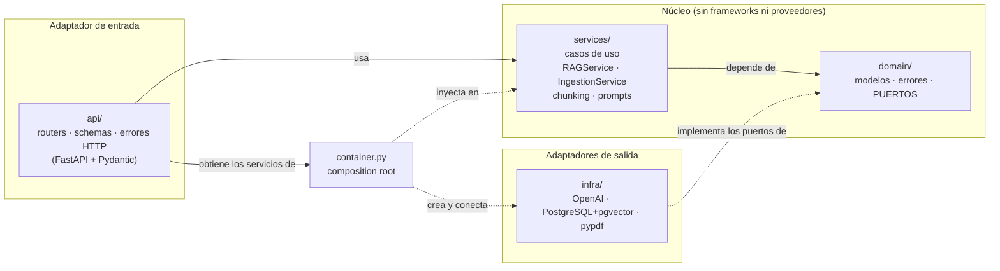
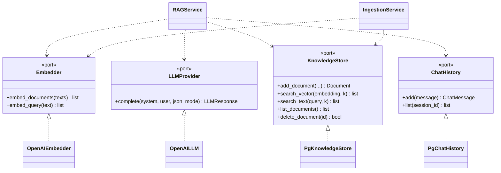
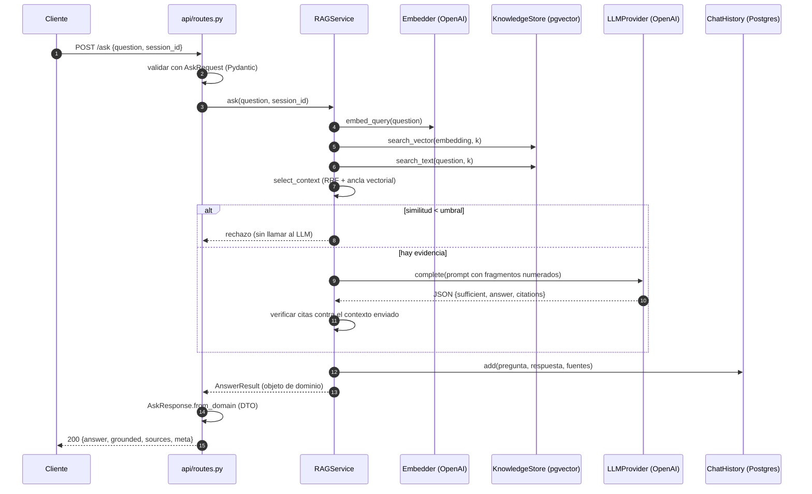

# Arquitectura del backend

Este documento describe cómo está organizado el backend (`backend/app`), qué patrones de diseño
usa, dónde está cada uno y cómo se relacionan las capas. Las decisiones y sus alternativas
están en [DECISION_LOG.md](../DECISION_LOG.md); aquí se explica la **estructura**.

## 1. Visión general: arquitectura hexagonal

El backend sigue **arquitectura hexagonal (puertos y adaptadores)** con la **regla de
dependencias** de Clean Architecture: *las dependencias apuntan siempre hacia el dominio*. El
núcleo (reglas del negocio RAG) no conoce FastAPI, OpenAI ni PostgreSQL; son detalles
intercambiables que se conectan por interfaces.

Lectura del diagrama: las flechas continuas son dependencias de código (`import`); las
punteadas son "implementa" o "ensambla". Nada del núcleo apunta hacia `infra` ni `api`.

### Las capas

| Capa | Carpeta | Responsabilidad | Puede importar |
|---|---|---|---|
| **Dominio** | `app/domain` | Modelos inmutables, errores del negocio y **puertos** (contratos). Cero dependencias externas. | solo `domain` |
| **Aplicación** | `app/services` | **Casos de uso**: orquestan el flujo RAG y la ingesta. Contienen las reglas (umbral, verificación de citas, fusión RRF, chunking). | `domain`, `services` |
| **Infraestructura** | `app/infra` | **Adaptadores** que implementan los puertos con tecnología concreta: OpenAI, Postgres/pgvector, pypdf. | `domain`, `core`, `infra` |
| **API** | `app/api` | **Adaptador de entrada**: HTTP, validación, DTOs, traducción de errores a códigos de estado. | `domain`, `container`, `core` |
| **Composición** | `app/container.py` | Único lugar que decide *qué implementación* usar y la inyecta. | todas |
| **Configuración** | `app/core` | `Settings` desde variables de entorno. | — |

Esta tabla **se hace cumplir con una prueba** (`backend/tests/test_architecture.py`): falla si
el núcleo importa `fastapi`, `openai`, `sqlalchemy`, `pypdf`, etc., o si una capa importa otra no
permitida.

## 2. Los puertos (el corazón del desacoplamiento)

Definidos en [`domain/ports.py`](../backend/app/domain/ports.py) como `typing.Protocol`:

`RAGService` e `IngestionService` solo conocen las cuatro interfaces. Para cambiar de
proveedor (por ejemplo, otro LLM o Qdrant en lugar de pgvector) se escribe un adaptador nuevo
en `infra/` y se cambia **una línea** en `container.py`; los servicios y sus pruebas no se
tocan.

## 3. Flujo de una consulta (`POST /ask`) a través de las capas

Tres puntos de este flujo ilustran la separación de capas:

- La **validación de formato** vive en la API (Pydantic); las **reglas del negocio** (umbral,
  citas) viven en el servicio.
- El servicio devuelve un **objeto de dominio** (`AnswerResult`); es la API la que lo convierte
  en el **DTO** de respuesta. El dominio no sabe cómo se serializa.
- Las llamadas a OpenAI y Postgres pasan por **puertos**; el servicio no sabe con qué
  tecnología hablan.

## 4. Patrones de diseño utilizados

| Patrón | Dónde | Para qué |
|---|---|---|
| **Arquitectura hexagonal (puertos y adaptadores)** | `domain/ports.py` + `infra/` | Aislar el núcleo de proveedores y frameworks |
| **Inversión de dependencias (DIP)** | servicios dependen de `Protocol`, no de clases concretas | El núcleo no depende de los detalles; los detalles dependen del núcleo |
| **Inyección de dependencias (por constructor)** | `RAGService.__init__`, `IngestionService.__init__` | Pasar colaboradores desde fuera; permite dobles en pruebas |
| **Composition Root** | [`container.py`](../backend/app/container.py) `build_services` | Un único sitio donde se eligen e instancian las implementaciones |
| **Adapter** | `OpenAIEmbedder`, `OpenAILLM`, `PgKnowledgeStore`, `PgChatHistory` | Adaptar APIs concretas a los puertos del dominio |
| **Repository** | `KnowledgeStore`, `ChatHistory` | Ocultar el acceso a datos tras una interfaz orientada al dominio |
| **Strategy** | `Embedder`/`LLMProvider` intercambiables; `extract_pages` inyectado como función | Variar el algoritmo/proveedor sin tocar al cliente |
| **Application Service / Use Case** | `RAGService`, `IngestionService` | Orquestar el flujo de cada caso de uso |
| **DTO + Mapper** | `api/schemas.py` (`from_domain`) frente a `domain/models.py` | Separar el contrato HTTP del modelo interno |
| **Value Object inmutable** | `@dataclass(frozen=True)` en `domain/models.py` | Modelos sin estado mutable, seguros de compartir |
| **Application Factory** | `create_app(services, settings)` en `main.py` | Crear la app con dependencias sustituibles (pruebas) |
| **Factory function** | `build_services`, `build_client` | Encapsular la construcción de objetos complejos |
| **Anti-Corruption Layer (traducción de errores)** | `_translate_errors` en `infra/openai_provider.py` | Que las excepciones de OpenAI no crucen al núcleo; se traducen a errores de dominio |
| **Manejo centralizado de excepciones** | `api/errors.py` (`STATUS_BY_ERROR`, `register_error_handlers`) | Un único lugar mapea error de dominio → HTTP con formato uniforme |
| **Bulkhead (aislamiento de recursos)** | `asyncio.Semaphore` en `RAGService` (`_llm_slots`) | Limitar llamadas simultáneas al LLM para no saturar cuota ni memoria |
| **Retry con backoff + Timeout** | cliente OpenAI (`max_retries`, `timeout`) | Tolerar fallos transitorios del proveedor |
| **Pipeline** | `_answer`: recuperar → filtrar → generar → verificar | Pasos secuenciales, cada uno con una responsabilidad |
| **Defensa en capas / Fail-fast** | umbral → prompt → JSON → verificación de citas | Ninguna capa basta sola; cada una descarta lo inseguro |
| **Fitness function arquitectónica** | `tests/test_architecture.py` | Hacer cumplir la regla de dependencias automáticamente |
| **Singleton de configuración** | `get_settings()` con `lru_cache` | Una sola instancia de `Settings` por proceso |
| **Duck typing estructural** | `typing.Protocol` en lugar de herencia (ABC) | Los adaptadores cumplen el contrato sin heredar de él |

## 5. Cómo se relacionan las capas, en concreto

**`api` → `container` → `services` → `domain` ← `infra`**

1. **La API no instancia nada.** Obtiene el objeto `Services` desde `app.state` (inyectado por
   `create_app`) mediante `Depends(get_services)`. Solo importa `container.Services`, no las
   clases de servicio.
2. **El contenedor ensambla.** `build_services` crea el motor de BD, los adaptadores
   (`PgKnowledgeStore`, `OpenAIEmbedder`...) y los inyecta en los servicios.
3. **Los servicios orquestan.** Reciben puertos, aplican las reglas y devuelven objetos de
   dominio. No saben que existe HTTP, ni OpenAI, ni SQL.
4. **El dominio es el contrato común.** Modelos, errores y puertos son lo único que ven en
   común los servicios y los adaptadores.
5. **Los adaptadores implementan.** `infra` cumple los puertos y traduce errores del mundo
   exterior a errores de dominio.

### Pruebas: el beneficio práctico de esta estructura

| Nivel | Qué se sustituye | Archivos |
|---|---|---|
| Unitarias del núcleo | puertos por **dobles en memoria** (sin red ni BD) | `tests/fakes.py`, `test_rag_service.py`, `test_ingestion.py` |
| API | servicios con fakes inyectados vía `create_app(services=...)` | `test_api.py` |
| Integración | adaptador real de Postgres contra la BD real | `test_pg_integration.py` |
| Arquitectura | el propio código fuente (análisis de imports) | `test_architecture.py` |

## 6. Compromisos conocidos (decisiones conscientes)

- **No hay puertos de entrada formales.** La API llama directamente a las clases de servicio;
  introduciría interfaces de caso de uso si hubiera más adaptadores de entrada (CLI, cola de
  mensajes, gRPC).
- **Lógica de dominio dentro de `services/`.** La fusión RRF y la validación de citas son
  funciones puras y podrían vivir en `domain/`; se mantienen junto a su único consumidor
  mientras el proyecto es pequeño.
- **`infra` y `api` dependen de `core.config`** (`Settings`) para leer configuración; es una
  dependencia de utilidad, no de negocio.
- **SQL explícito** (SQLAlchemy Core) en lugar de ORM: el SQL de pgvector/`tsvector` es
  específico y se prefirió control y legibilidad.
- **Sin framework de IA** (LangChain/LlamaIndex): el flujo es corto y se quiso poder explicar y
  probar cada paso.
